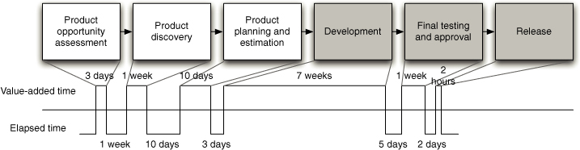

# Process pipeline
is sketch of all stages of development process beginning from idea to end user delivery

From this visualization you can see value-added time and elapsed time and understand were you can optimize process for 
delivering features and value more rapidly.