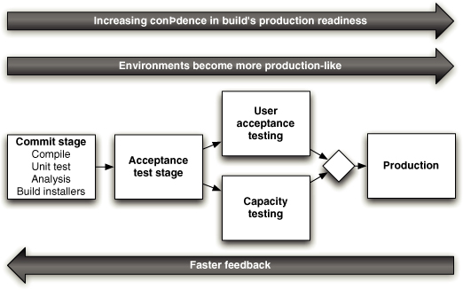
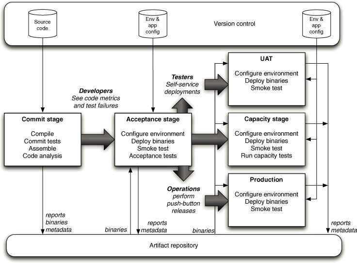

# Deployment pipeline
is automated manifest for getting software from VCS to end uses

## Common signs of absence

* Build and operation teams waiting for documentations or fixes to configuration or environment
* Testers and Analytics wait for needed build on needed environment
* Developers teams receive bug reports after long time feature has been finished 
* Discovering in the end that system will not support it nonfunctional requirements

## Stages and characteristics

On this visualization you can see common pipeline stages recognize their characteristics

* Commit stage asserts that system is valid on technical level
* Automated acceptance tests assert that system works at functional level
* Manual test stage asserts that system is usable and fulfills its requirements from user point of view
* Capacity test asserts that system meets it nonfunctional requirements
* Release stage delivers system to users

From this diagram you can point out that every next stage:

* increase our confidence in meeting requirements
* environment of test becomes more production like
* Feedback loop grows

# Best practises of deployment pipeline

That's like common pipeline flow looks like:

[Stages description](index.md)

Version control is storage of input pipeline information.
For example: source code, environment information, application configuration, deployment scripts

Artifacts storage is storage of output artifacts and metadata.
For example: binaries, assets, metadata, reports.
 
## In-depth stages description

* [Commit stage](commit_stage.md)
* [Automated test stage](automated_test_stage.md)
* [Subsequent test stage](subsequent_test_stage.md)
* [Release](release.md)

## Best practices
* **Only build your binaries once** - recreating binaries may result into different version of binaries running on 
different stages which is ambiguous and error prone. Also it requires time to build binaries again which may result 
into slower pipeline execution
* **Use same deploy script for every environment** - that leads to completely tested on different environments before 
execution on production
* **Smoke test your application** - after release run basic ETE test against your application to ensure basic 
functionality works and release ended up successfully.
* **Deploy into copy of production** - last stages of your pipeline before release on production has to be run 
against production like environment with same network topology, firewalls, databases, etc. to eliminate difference bugs 
and don't produce environment specific that do not appear on production.
* **If any stage of pipeline fails - stop it** failing of any step means that application is in invalid state, 
perhaps for described criteria. Stop release process and maki it stae valid. Also ignoring pipeline error may result 
into always failing pipeline therefore errors will appear again and again and application will rot.
 
## Related

Not every transition in your pipeline has to be automated - deploys to production and manual acceptance test can be 
manual.

Information about current pipeline status and candidates road through the pipeline should be visible to everybody.

Sometimes many builds are executed at same time, but later stages takes a lot of time.
Smart propagation - is approach to chose latest **waiting** for propagation build and continue pipeline after road of
current release candidate is ended.