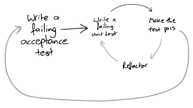

### TDD
is practice of writing tests before implementation of feature they relates to (test first). 

### Guideline

There are main guidelines which should be executed step by step:
* write failing unit test 
* write code to make this test pass
* refactor related code

Or from other restrictive point of view:
* You don't allowed to write any line of production code before creating single unit test to this code
* You don't allowed to write any more test code before making production code pass that test
* You don't allowed to write any more production code after making test pass. (in case of functionality not refactoring)

Also good practice in case of adding new feature rather than changing existing writing single high level unit 
acceptance test is considered good practice. After writing acceptance test you are going on with wring unit tests and
passing them till your acceptance test pass. After making it pass you know that your job related to this scenario is 
finished and you can continue with other. This will lock you in larger and longer cycle of scenario.

In such case you will achieve best code coverage possible.
Refactoring stage is highly possible because of high coverage.

**Remember**: Working is not finished

### Advantages
* Clarifies what you try to achieve before implementing it - reduce amount of useless code
* Focusing on single feature per time
* More iterative approach
* Good code coverage
* Check not only your code but also tests before code execution
* Strict guideline how to approach any feature 
