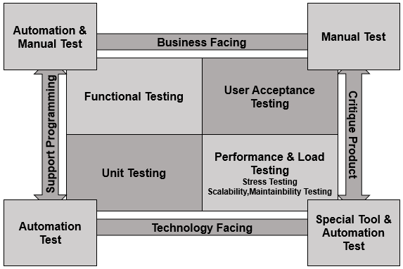
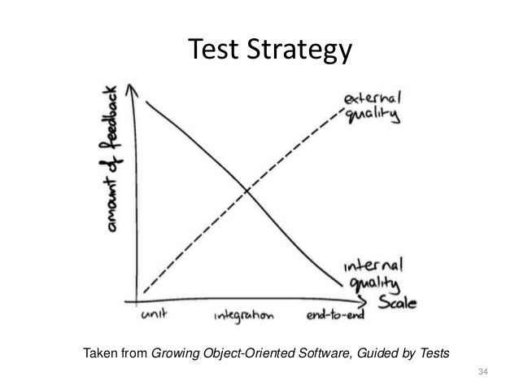

## Testing quadrants

Was introduced by Brain Marick to group test by desire.
Business and technology facing are described [here](types.md).
Test that supporting programming ensure basic system requirements enforced.
On the other hand critique test are dedicated to enforce additional boundaries for project. 

## Internal and External quality

There is strong connection between granularity of tests and quality type they ensure.
Therefore:
* More high granular tests enforce external(business) quality.
* More low granular tests enforce internal(technical) quality.

